##############################################################################
Preface
##############################################################################

ESP32-S3 WROOM
**********************************

The ESP32-S3-WROOM-1 offers two antenna options: the PCB on-board antenna and the IPEX antenna.

- The PCB on-board antenna is an integrated antenna within the chip module itself, making it compact and convenient for both portability and design.

- The IPEX antenna is an external metal antenna connected to the module's integrated antenna, providing enhanced signal performance.

+----------------------+--------------+
| PCB on-board antenna | IPEX antenna |
|                      |              |
| |Preface00|          | |Preface01|  |
+----------------------+--------------+

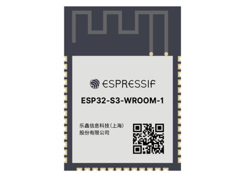
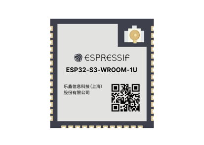

The ESP32-S3 WROOM of this product is based on the ESP32-S3-WROOM-1 module with built-in PCB on-board antenna.

+----------------+
| ESP32-S3 WROOM |
|                |
| |Preface02|    |
+----------------+

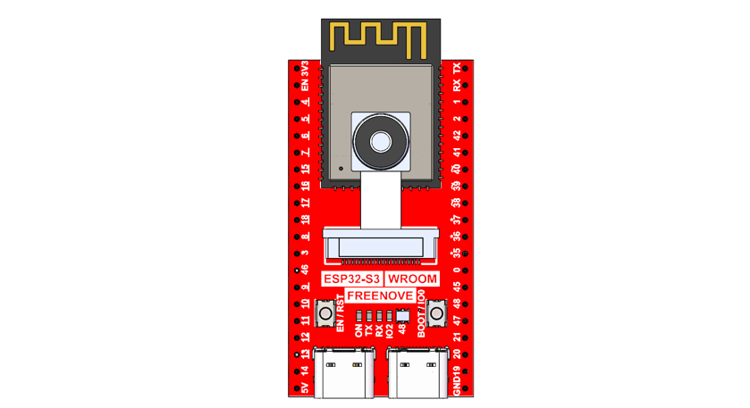

The hardware interfaces of ESP32-S3 WROOM are distributed as follows:

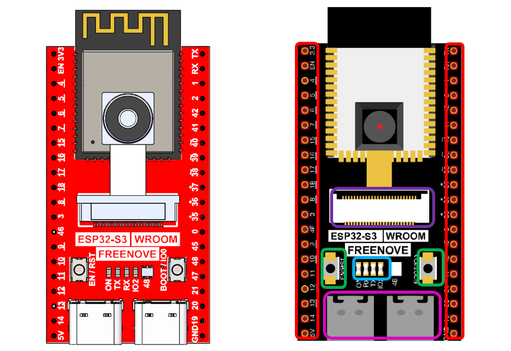

Compare the left and right images. We've boxed off the resources on the ESP32-S3 WROOM in different colors to facilitate your understanding of the board.

+-------------+------------------------------------------+
|  Box color  |   Corresponding resources introduction   |
+=============+==========================================+
| |Preface04| | GPIO pins                                |
+-------------+------------------------------------------+
| |Preface05| | LED indicators                           |
+-------------+------------------------------------------+
| |Preface06| | Camera interface                         |
+-------------+------------------------------------------+
| |Preface07| | Reset button, Boot mode selection button |
+-------------+------------------------------------------+
| |Preface08| | USB ports                                |
+-------------+------------------------------------------+

For more information, please visit: https://www.espressif.com.cn/sites/default/files/documentation/esp32-s3-wroom-1_wroom-1u_datasheet_en.pdf. 

**GPIO pins of ESP32-S3 WROOM can be used to interface with external devices and control peripheral circuits.**

Freenove Media Kit for ESP32-S3
*******************************************

Freenove Media Kit for ESP32-S3 is an expansion board designed for the Freenove ESP32-S3 WROOM Board. Its key features are illustrated below.

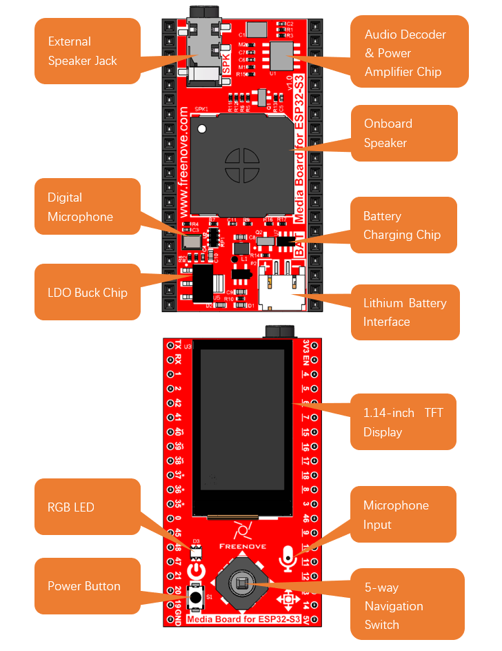

+--------------------------------+--------------------------------+--------------------------------+
| The battery interface uses a PH2.0mm, 2-pin connector.                                           |
|                                                                                                  |
| You can purchase a lithium battery of any capacity, but please ensure the battery's              |
|                                                                                                  |
| rated voltage range is between 3.7V and 4.2V.                                                    |
|                                                                                                  |
| |Preface10|                                                                                      |
|                                                                                                  |
| Important Note:                                                                                  |
|                                                                                                  |
| This product does not include a lithium battery—please purchase one separately.                  |
|                                                                                                  |
| The device can still function normally even without a battery.                                   |
|                                                                                                  |
| The recommended battery size is: 7.5mmx20mmx35mm.                                                |
|                                                                                                  |
| You can search for 702035 on any shopping platform.                                              |
|                                                                                                  |
| |Preface11|                                                                                      |
+--------------------------------+--------------------------------+--------------------------------+
| We recommend using the dedicated charger designed for your lithium battery.                      |
|                                                                                                  |
| Since lithium batteries vary in specifications and quality, using the correct                    |
|                                                                                                  |
| charger helps ensure optimal performance, safety, and longevity.                                 |
|                                                                                                  |
| While our product also supports USB charging as a backup option,                                 |
|                                                                                                  |
| please note that this method does not support fast charging and                                  |
|                                                                                                  |
| provides only a slow, standard charge.                                                           |
|                                                                                                  |
| |Preface12|                                                                                      |
|                                                                                                  |
| Charging & Power Indicators:                                                                     |
|                                                                                                  |
| When using the USB port on the board to charge the battery:                                      |
|                                                                                                  |
| While charging, the blue LED will blink.                                                         |
|                                                                                                  |
| When charging is complete, the blue LED will stay lit.                                           |
|                                                                                                  |
| If no battery is connected, the blue LED will keep blinking.                                     |
|                                                                                                  |
| When the device is not connected to USB, it runs on battery power,                               |
|                                                                                                  |
| and the green LED remains steadily lit.                                                          |
+--------------------------------+--------------------------------+--------------------------------+
| The onboard speaker can be used to play any audio, but the volume may be relatively low.         |
|                                                                                                  |
| If you wish to use external speakers, you can connect them via the headphone jack.               |
|                                                                                                  |
| This product features a 3.5mm TRS headphone socket.                                              |
|                                                                                                  |
| If you intend to connect your own speakers using an audio cable,                                 |
|                                                                                                  |
| please ensure you purchase a compatible 3.5mm TRS plug.                                          |
|                                                                                                  |
| |Preface13|                                                                                      |
|                                                                                                  |
| Our headphone jack typically outputs audio through the right channel.                            |
|                                                                                                  |
| If you want to connect external speakers, please refer to the wiring diagram below.              |
|                                                                                                  |
| |Preface14|                                                                                      |
+--------+--------------------------+----------------------------+---------------------------------+
| |Preface15|                       | Tip                        | Left channel                    |
+                                   +----------------------------+---------------------------------+
|                                   | Ring                       | Right channel                   |
+                                   +----------------------------+---------------------------------+
|                                   | Sleeve                     | GND                             |
+--------+--------------------------+----------------------------+---------------------------------+
| OMTP   | |Preface16|              | Tip                        | Left channel                    |
+        +                          +----------------------------+---------------------------------+
|        |                          | Ring1                      | Right channel                   |
+        +                          +----------------------------+---------------------------------+
|        |                          | Ring2                      | Microphone                      |
+        +                          +----------------------------+---------------------------------+
|        |                          | Sleeve                     | GND                             |
+--------+--------------------------+----------------------------+---------------------------------+
| CTIA   | |Preface17|              | Tip                        | Left channel                    |
+        +                          +----------------------------+---------------------------------+
|        |                          | Ring1                      | Right channel                   |
+        +                          +----------------------------+---------------------------------+
|        |                          | Ring2                      | GND                             |
+        +                          +----------------------------+---------------------------------+
|        |                          | Sleeve                     | Microphone                      |
+--------+--------------------------+----------------------------+---------------------------------+

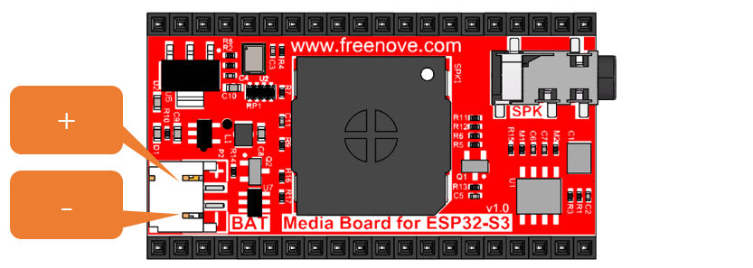

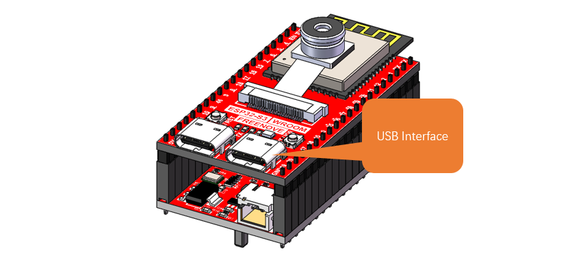
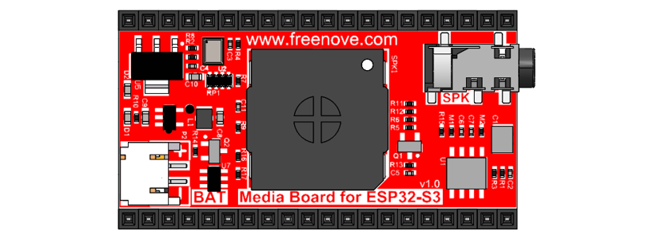

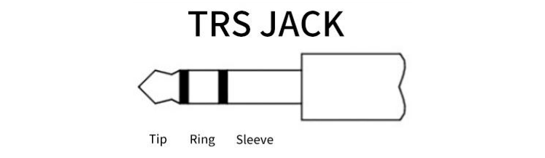
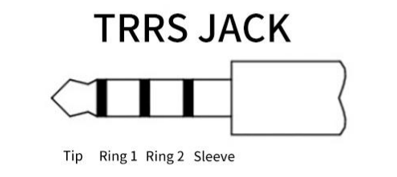
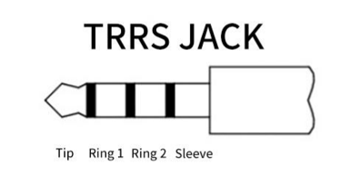

Notes for GPIO
*****************************************

GPIO Pinout Table
===========================================

To learn what each GPIO corresponds to, please refer to the following table.

The functions of the pins are allocated as follows:

+----------------+-----------------+-------------------------+
| ESP32-S3 N16R8 |    Funtions     |       Description       |
+================+=================+=========================+
| GPIO48         | WS2812_DIN      | WS2812                  |
+----------------+-----------------+-------------------------+
| GPIO21         | LCD_SDA         |                         |
+----------------+-----------------+                         |
| GPIO47         | LCD_SCK         |                         |
+----------------+-----------------+                         |
| GPIO45         | LCD_D/C         | TFT_LCD                 |
+----------------+-----------------+                         |
| GPIO20         | LCD_RST         |                         |
+----------------+-----------------+-------------------------+
| GPIO14         | MIC_WS          |                         |
+----------------+-----------------+                         |
| GPIO3          | MIC_SCK         | Mic                     |
+----------------+-----------------+                         |
| GPIO46         | MIC_SD          |                         |
+----------------+-----------------+-------------------------+
| GPIO19         | PowerButton_COM | Power Button            |
+----------------+-----------------+-------------------------+
| GPIO41         | NS4168_LRCLK    |                         |
+----------------+-----------------+                         |
| GPIO42         | NS4168_BCLK     | Digital Power Amplifier |
+----------------+-----------------+                         |
| GPIO1          | NS4168_SDATA    |                         |
+----------------+-----------------+-------------------------+
| GPIO4          | SIOD            |                         |
+----------------+-----------------+                         |
| GPIO5          | SIOC            |                         |
+----------------+-----------------+                         |
| GPIO6          | CSI_VYSNC       |                         |
+----------------+-----------------+                         |
| GPIO7          | CSI_HREF        |                         |
+----------------+-----------------+                         |
| GPIO16         | CSI_Y9          |                         |
+----------------+-----------------+                         |
| GPIO15         | XCLK            |                         |
+----------------+-----------------+                         |
| GPIO17         | CSI_Y8          |                         |
+----------------+-----------------+                         |
| GPIO18         | CSI_Y7          | Camera                  |
+----------------+-----------------+                         |
| GPIO13         | CSI_PCLK        |                         |
+----------------+-----------------+                         |
| GPIO12         | CSI_Y6          |                         |
+----------------+-----------------+                         |
| GPIO11         | CSI_Y2          |                         |
+----------------+-----------------+                         |
| GPIO10         | CSI_Y5          |                         |
+----------------+-----------------+                         |
| GPIO9          | CSI_Y3          |                         |
+----------------+-----------------+                         |
| GPIO8          | CSI_Y4          |                         |
+----------------+-----------------+-------------------------+
| GPIO38         | SD_CMD          |                         |
+----------------+-----------------+                         |
| GPIO39         | SD_CLK          | SD Card                 |
+----------------+-----------------+                         |
| GPIO40         | SD_D0           |                         |
+----------------+-----------------+-------------------------+

For more information, refer to the schematic.

PSRAM Pin
=========================================

The module on the ESP32-S3-WROOM board utilizes the ESP32-S3R16 chip, which comes with 8MB of external Flash. When using the OPI PSRAM, it should be noted that GPIO35-GPIO37 on the ESP32-S3-WROOM board will not be available for other purposes. However, when OPI PSRAM is not used, GPIO35-GPIO37 on the board can be used as normal GPIO.

.. image:: ../_static/imgs/Preface/Preface18.png
    :align: center

SDcard Pin
=======================================

An SDcard slot is integrated on the back of the ESP32-S3-WROOM board, and we can use GPIO38-GPIO40 of ESP32-S3-WROOM to drive SD card.

The SDcard of ESP32-S3-WROOM uses SDMMC, a 1-bit bus driving method, which is integrated in the Arduino IDE, and we can call the "SD_MMC.h" library to drive it. For more details, please refer to the SDcard chapter in this tutorial.

USB Pin
======================================

Please note that in this product, GPIO20 is used for both battery voltage sampling (ADC) and LCD reset signal (RST). Therefore, it must not be configured for USB functions to avoid signal interference.

Cam Pin
======================================

When using the camera on our ESP32-S3-WROOM, please check its pin assignments. Pins marked with underlined numbers are dedicated to the camera function. If you intend to use additional functions alongside the camera, avoid using these pins to prevent conflicts.
